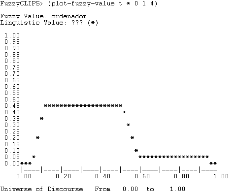

## Descripción

Se desarollará un sistema basado en reglas que sea capaz de diagnosticar un conjunto de problemas a la hora de arrancar un ordenador.
El objetivo es poder averiguar cuál es el error y saber qué lo ha causado.
Se podrán tratar varios sistemas operativos para abarcar más posibilidades, además, se tendrá en cuenta las diferentes fases del arranque: desde que se recibe corriente hasta que el sistema operativo está completamente cargado y se está en una pantalla de inicio de sesión.

Para llevar a cabo este sistema, se cuenta con un ingeniero del conocimiento: Samuel Espejo Gil.
Y varios expertos: un sub conjuntos de los contratados durante la primera mitad del 2024 en el área TIC de la biblioteca Bernardo Balbuena, en Ciudad Real, estos son:

- Manuel Díaz-Marta Puentes
- Roberto Gonzalez Manzano

### Necesidad y justificación

El sistema se desrrollará como prácticas para la asignatura de Sistemas Basados en el Conocimiento.

Se espera que una vez esté desarollada, cualquier becario sea capaz de diagnosticar problemas sin la ayuda de los expertos, dotando de mayor autonomía a los becarios y de más tiempo a los expertos.

Actualmente se cuenta con una ficha de casos comunes que los becarios consultan, pero esta es una mera recolección no estructurada, dividida en varias hojas con diferentes datos.
Se busca que con este sistema todo ese conocimiento, y el que no está en la hojas, si no en los expertos, sea recogido y formalizado en el programa.

La necesidad no es extrema, los expertos son capaces de ceder tiempo y explicar cuando se les requiere, pero ello les quita tiempo de trabajo.
Aunque por las tardes, los expertos no están y sólo se encuentran los becarios, por lo que en estos casos, se procede con el caso más extremo, pedir que se devuelva el ordenador para inspección futura de los expertos.
Esta aplicación permitiría no requerir de estas situaciones.

### Alcance y límites

Se tratará toda la fase de arranque, esta se define desde que el ordenador recibe corriente, se pulsa el botón físico de arranque, hasta que el ordenador tiene el sistema operativo cargado y requiere un inicio de sesión de algún usuario.

Los sistemas operativos tenidos en cuenta son:

- Windows 10 education
- Windows 11 education
- Windows 10 pro
- Windows 11 pro
- Windows 10 enterprise
- Windows 11 enterprise

Versiones que permitan inclusión de dominio.

Como hardware posible, sólo portátiles, de cualquier modelo prestado por la universidad:

- Lenovo Thinkpad Yoga 20C0
- HP Notebook 340S G7
- HP Elitebook x360 1040 G6
- HP Elitebook 840 G3
- HP Elite x2 G4<!-- El mejor, el de los profes -->
- HP Elitebook 745 G6

Como excepciones y límites, no se contemplarán ordenadores de Apple, cualquier MAC u otro dispositivo que cuente con un sistema de esta empresa.
Aunque estos también son prestados por la universidad, siguen procesos lo suficientemente diferentes como para ser tratados a parte, por lo que no son ámbito de este programa.
Tampoco se contemplarán distribuciones de linux.

## Viabilidad

Para estudiar la viabilidad se llevará a cabo el test de Slagel, en el anexo se puede encontrar tablas que cuentan con toda la información, aquí sólo se comentará los casos más importantes.

Para realizar este test, se ha creado un documento de hojas de cálculo con las diferentes características y pesos vistos en clase.
En el documento se pueden encontrar todos los valores dados y los cálculos realizados.

- P5: Generalmente, cada semana suele traerse un ordenador que necesita ser tratado de estos problemas.
- P6: Los procesos de diagnóstico y tratamiento suelen empezar siendo los mismos.
- J1: Durante las horas de la tarde, no se cuenta con ninguno.
- J4: Depende del usario que venga con el problema del ordenador.
- J5: Hasta el momento, no se ha devuelto ningún ordenador a fábrica.
- A1: Se cuenta con una recolección de casos, pero es lo más general y no se sigue un orden ni hay un índice.
- A6: Se puede identificar una secuencia de pasos.
- A10: Generalmente, para solucionar estos problemas hay que revisar diversos manuales, del fabricante, de la bios, del sistema operativo...
- E3: Que el ordenador vuelva a arrancar, a la primera, sin necesidad de intervención humana más que pulsar el botón.

| Característica | Total |
| :-- | --: |
| Plausibilidad | 95.75% |
| Justificación | 82.89% |
| Adecuación | 75.55% |
| Éxito | 76.60% |
| Media | 82.70% |

table: Porcentajes de viabilibdad de cada grupo de características

Como la media nos da 82.7%, es viable llevar a cabo el sistema.

## Adquisición

Se ha llevado a cabo una serie de entrevistas, principalmente con el experto Manuel Díaz-Marta Puentes.
Estas quedaron registradas en audio para su estudio, a su vez, el ingeniero de conocimiento, Samuel Espejo Gil, iba tomando apuntes en un papel.

En la gran mayoría de las sesiones se planteaban varias preguntas a las que el experto contestaba.
Estas preguntas habían surgido de la misma sesión o eran una colección de preguntas obtenidas del estudio de las sesiones anteriores.
En ciertos momentos, el experto desarrollaba nuevos temas sin necesidad de ser preguntado, aunque esto era en ocasiones poco comunes.

Las sesiones no solían durar más de media hora al día para no entorpecer el trabajo del mismo ya que estas tomaban lugar en el entorno laboral.
Se tomó esta decisión por compatibilidad de horarios.

Las sesiones tomaron lugar entre Marzo y principios de Abril de 2024.

En ninguna de las sesiones se produjo algún contratiempo.

## Conceptualización

Gran parte de la información sacada de las entrevistas se ha filtrado ya que, en su mayor parte, era información para poner en situación.
No se especificaban reglas, relaciones o métodos.

Aquí se ha recopilado aquella información útil para poder determinar el estado de un dispositivo o la forma de actuar respecto a este.

1. El modelo thinkpad es antiguo.
2. El modelo notebook está muy usado.
3. Todos los ordenadores tienen una batería.
4. Una batería puede estar degradada, en cuyo caso no carga y el ordenador tiene voltaje suficiente para mostrar ningún tipo de señal.
5. La batería está cargando, si al conectarse a corriente, se enciende el respectivo indicador luminoso.
6. Si el ordenador no tiene voltaje, no podrá encenderse.
7. La batería se degrada con el tiempo y uso.
8. Todos los ordenadores tienen almacenamiento.
9. El almacenamiento se degrada con el tiempo y uso.
10. Un ordenador se puede conectar a corriente mediante un cargador.
11. Cuando un ordenador está conectado a corriente, tiene suficiente voltaje para operar el hardware.
12. Cuando el ordenador es capaz de operar el hardware, lo muestra mediante un indicador luminoso.
13. Todos los ordenadores tienen BIOS.
14. La BIOS es capaz de hacer un análisis de almacenamiento y detectar si está degradado.
15. La BIOS tiene la configuración de SecureBoot, que puede estar activada o desactivada. Esta se puede cambiar.
16. SecureBoot comprueba que si el sistema operativo ha sido alterado, en cuyo caso no permite iniciar.
17. Si la BIOS detecta que el hardware está correctamente, da paso al BootLoader.
18. El bootloader se encuentra en el almacenamiento.
19. El bootloader no puede cargar el sistema operativo si este está corrupto o encriptado sin clave.
20. Se puede reaprovisionar un sistema operativo borrando los contenidos del disco.
21. El sistema operativo ofrecido por la UCLM ha sido alterado.
22. La UCLM impone que el disco de los dispositivos esté encriptado.
23. El sistema operativo hace una conexión con Itune para comprobar si el ordenador está registrado en una orgnaización.
24. Cuando el sistema operativo detecta que está registrado en una organización, muestra la pantalla de login de esta.
25. En caso de no estar registrado, se muestra un login para usuarios locales.
26. Todos los usuarios de la UCLM tienen unos credenciales.
27. Si un usuario no se acuerda de sus credenciales, puede reestablecerlos mediante un CAU.

A continuación se ha creado una ontología del dominio, donde se pueden ver las relaciones encontradas entre los diferentes elementos.

También se han creado unas tablas objeto-atributo-valor que permiten ver los diferentes estados de ciertos elementos que se han identificado.

Los diferentes estados de acada atributo pueden ser evaluados por el usuario, aunque no todos estos se pueden obtener en todo momento.
Por ejemplo, un ordenador con inicio nulo no permite saber a simple vista si está registrado ya que no se observa la pantalla de login, aunque se puede llegar a determinar haciendo uso de la herramienta Itune.

+-----------+------------+---------------------------------------------+
| Objeto    | Atributo   | Valor                                       |
+===========+============+=============================================+
| Ordenador | inicio     | {nulo, corriente, bios, bootloader, sesion} |
|           +------------+---------------------------------------------+
|           | bateria    | {cargando, rota}                            |
|           +------------+---------------------------------------------+
|           | secureboot | {activado, desactivado}                     |
|           +------------+---------------------------------------------+
|           | corriente  | {conectada, desconectada}                   |
|           +------------+---------------------------------------------+
|           | modelo     | {thinkpad, notebook, elitebook, elite}      |
|           +------------+---------------------------------------------+
|           | registrado | {uclm, no, otro}                            |
+-----------+------------+---------------------------------------------+
table: Tabla objeto atributo valor sobre el ordenador

+----------------+------------+-----------------------------------+
| Objeto         | Atributo   | Valor                             |
+================+============+===================================+
| Almacenamiento | contenido  | {SO, corrupto}                    |
|                +------------+-----------------------------------+
|                | tipo       | {SSD, HDD}                        |
|                +------------+-----------------------------------+
|                | bitlocker  | {desbloqueado, bloqueado}         |
|                +------------+-----------------------------------+
|                | estado     | {roto, degradado, usado, bueno}   |
+----------------+------------+-----------------------------------+
table: Tabla objeto atributo valor sobre el almacenamiento

### Glosario

Corriente

: Se refiere a la conexión del ordenador a electricidad mediante un cargador.

Secure boot

: Es una opción de la bios de los ordenadores. Comprueba si el sistema operativo ha sido alterado.

BIOS

: Software encargado de inicializar el hardware y dar control al bootloader.

Bootloader

: Software que carga el sistema operativo.

Sistema Operativo

: Software controlador del dispositivo.

Login

: Pantalla de acceso al escritorio.

BitLocker

: Servicio de encriptado de disco de Windows.

Aprovisionado

: Se dice de la instalación del sistema operativo en un dispositivo.

Almacenamiento

: Dispositivo que guarda datos de forma persistente

SSD

: Disco de estado sólido. Almacenamiento.

HDD

: Disco duro de almacenamiento. Magnético y rotatorio.

Dominio

: Agrupación de dispositivos controlados por una organización.

Itune

: Herramienta que permite controlar los dispositivos de un dominio.

## Representación del conocimiento

Usaremos reglas.
El listado visto en [conceptualización](#conceptualización) será pasado a reglas:

1. Si el modelo es ThinkPad o Notebook, entonces se considera antiguo.
1. Si la batería está encendida, entonces se considera que hay voltaje suficiente.
1. Si la corriente está conectada, también se considera que hay voltaje suficiente.
1. Si el inicio es nulo y el voltaje es suficiente, se registra un fallo desconocido.
1. Si la batería está apagada y la corriente está desconectada, se registra un fallo de corriente.
1. Si el modelo es antiguo y el inicio es nulo, se registra un fallo de batería.
1. Si el modelo es antiguo y el inicio es nulo, se registra un fallo de almacenamiento.
1. Si la corriente está conectada pero la batería está apagada, se registra un fallo de batería.
1. Si el inicio es BIOS y el Secure Boot está desactivado, se registra un fallo en la carga del sistema operativo.
1. Si el inicio es BIOS y el Secure Boot está activado, se registra un fallo de Secure Boot.
1. Si el disco está encriptado, se registra un fallo de BitLocker.
1. Si el disco está vacío, se registra un fallo de aprovisionamiento.
1. Si el inicio es sesión y la pantalla de login no es la de la UCLM, se registra un fallo de registro en dominio.
1. Si el inicio es sesión y la pantalla de login es de una cuenta local, se registra un fallo de registro en dominio.
1. Si las credenciales son desconocidas, se registra un fallo de CAU.

## Implementación

Para poner en funcionamiento el sistema experto se ha usado CLIPS.
Se puede encontrar la base de reglas en los ficheros clp correspondientes.
Cargando este, podremos añadir los hechos y ver qué conclusiones se obtienen.

Cuando se ejecuta el sistema de diagnóstico, se evalúan las condiciones basadas en las reglas anteriores.
Si se encuentra un fallo, se activa el hecho correspondiente (por ejemplo, “fallo de batería”).
Luego, una última regla especial se encargará de imprimir el fallo obtenido para que el usuario pueda tomar las medidas necesarias.
Esta se podrá lanzar varias veces si se han podido detectar varios fallos.

Una vez resueltos los problemas, se podría volver a iniciar el sistema y usar los nuevos datos obtenidos, por lo que se puede llegar a tener en funcionamiento el ordenador si se tratase con los conocimientos para arreglar los fallos indicados.

## Validación

Se propone un caso de ejemplo con los siguientes hechos:

1. Modelo: El ordenador es un ThinkPad.
1. Inicio: El ordenador llega a la BIOS
1. Batería: Está cargada.
1. Secure Boot: Está activado en la BIOS.
1. Disco: El disco está encriptado.

Para este, se espera ver 2 fallos:

1. Secure Boot.
1. BitLocker.

Este ejemplo ha sido creado y validado por Roberto Gonzalez Manzano.
Además, las reglas también han sido revisadas, dando visto bueno.

Por ello, el sistema es seguro, aunque el tratamiento del ordenador se hace a manos del usuario del sistema, por lo que la responsabilidad cae sobre el usuario.

## Lógica borrosa

En este ámbito, es difícil encontrar ejemplos que sean susceptibles de borrosificarse.
Aunque se han encontrado los siguientes ejemplos que son cercanos al hardware y permiten trabajar con ellos.
Se han añadido los siguientes conjuntos borrosos:

### Capacidad máxima batería

Se trata de definir cuánta capacidad como máximo puede llegar cargarse la batería.
Es un porcentaje, que disminuye con el tiempo.
Aunque la batería esté rota, el ordenador puede seguirse usando, sólo si este está conectado a corriente.

Se han definido las siguientes etiquetas para la definición del estado de la batería:

1. Rota: (0 1) (0.75 1) (0.83 0)
2. Degradada: (0.8 0) (0.87 1) (0.95 0)
3. Buena: (0.9 0) (0.95 1) (1 1)

### Ciclos lectura y escritura almacenamiento

Este representa la cantidad de ciclos de lectura y escritura que ha sufrido el almacenamiento.
A mayor cantidad, peor es el estado pudiendo llegar a quedarse inutilizable.
En caso de romperse, el ordenador requerirá un cambio de almacenamiento.

Las etiquetas definidas son:

1. Bueno: (0 1) (800 1) (1200 0)
2. Degradado: (1000 0) (1500 1) (2000 1) (2500 0)
3. Roto: (2300 0) (2500 1) (3000 1)

### Uso del ordenador

Indica cómo de usado está el ordenador.
Medido en porcentaje.
Puede estimar cuándo se debería hacer un cambio de este.

Se definen:

1. Bueno: (0 0) (0.1 1) (0.3 0)
1. Usado: (0.05 0) (0.2 1) (0.4 1) (0.6 0)
1. Degradado: (0.5 0) (0.7 1) (0.95 0)
1. Roto: (0.9 0) (0.95 1) (1 1)

### Regla

Ahora se pondrá un ejemplo para saber si el ordenador está roto respecto a los dos parámetros antes mencionados:

+:--------------------------+---------:+-------------:+-----------:+
| Almacenamiento \\ Batería |    Buena |    Degradada |       Rota |
+---------------------------+----------+--------------+------------+
| Bueno                     |    Bueno |        Bueno |      Usado |
+---------------------------+----------+--------------+------------+
| Degradado                 |    Usado |    Degradado |  Degradado |
+---------------------------+----------+--------------+------------+
| Roto                      |     Roto |         Roto |       Roto |
+---------------------------+----------+--------------+------------+

:table Relación entre el estado del almacenamiento, la batería y el ordenador.

Para probar, se ha puesto un ejemplo:

1. Capacidad batería: 0.7
1. Ciclos: 1024

El resultado es:

Este da:

0.314 como media del máximo.

## Anexo

| Identificador | Valor |
| :-- | --: |
| P1 | 10 |
| P2 | 10 |
| P3 | 10 |
| P4 | 8 |
| P5 | 9 |
| P6 | 10 |
| P7 | 10 |
| P8 | 10 |
| P9 | 9 |
| P10 | 10 |

table: Características de Plausibilidad

| Identificador | Valor |
| :-- | --: |
| J1 | 10 |
| J2 | 7 |
| J3 | 8 |
| J4 | 10 |
| J5 | 8 |
| J6 | 6 |
| J7 | 10 |

table: Características de Justificación

| Identificador | Valor |
| :-- | --: |
| A1 | 6 |
| A2 | 10 |
| A3 | 8 |
| A4 | 10 |
| A5 | 10 |
| A6 | 10 |
| A7 | 10 |
| A8 | 5 |
| A9 | 10 |
| A10 | 9 |
| A11 | 4 |
| A12 | 4 |

table: Características de Adecuación

| Identificador | Valor |
| :-- | --: |
| E1 | 10 |
| E2 | 10 |
| E3 | 10 |
| E4 | 6 |
| E5 | 5 |
| E6 | 10 |
| E7 | 5 |
| E8 | 8 |
| E9 | 8 |
| E10 | 7 |
| E11 | 10 |
| E12 | 10 |
| E13 | 5 |
| E14 | 10 |
| E15 | 10 |
| E16 | 4 |
| E17 | 8 |

table: Características de Éxito

